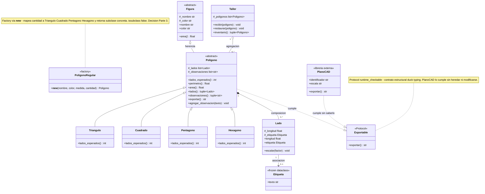

# Modelo final — TP Integrador Unidad 3 POO

Diagrama basado 100% en `figuras.py` (Partes 1 a 4).

## Cómo renderizarlo (elegí una)

**Opción A - Mermaid.live (recomendada, 10 segundos):**
1. Abrí https://mermaid.live
2. Borrá el ejemplo que aparece.
3. Copiá **SOLO** el bloque entre ` ```mermaid ` y ` ``` ` de abajo (desde `classDiagram` hasta la última `note`).
4. No copies la tabla que está después - esa no es parte del diagrama.
5. Exportá PNG/SVG con el botón Download.

**Opción B - Archivo puro:** usá `uml/modelo_final.mmd` que ya contiene solo el diagrama, sin tabla. Podés arrastrarlo a mermaid.live o abrirlo con cualquier editor.

**Opción C - UMLetino:** abrí `uml/modelo_final.uxf` en https://www.umlet.com/umletino/ (layout ya acomodado).

---



---

## Decisiones reflejadas (coherentes con el código)

| Elemento | En el diagrama | En `figuras.py` |
|---|---|---|
| `Figura` y `Poligono` abstractos | `<<abstract>>` + `*` | `class Figura(ABC)` `figuras.py:58`, `@abstractmethod area` `figuras.py:82`; `class Poligono(Figura)` `figuras.py:134`, `@abstractmethod lados_esperados` `figuras.py:162` |
| `Triangulo(3)`, `Cuadrado(4)`, `Pentagono(5)`, `Hexagono(6)` | Herencia `Poligono <|--` | `figuras.py:194-226` cada una valida `len(_lados) != esperados` en `Poligono.__init__` `figuras.py:155` |
| `PoligonoRegular` | `<<factory>>` sin flecha herencia | `class PoligonoRegular: __new__` `figuras.py:230-266` retorna `Triangulo/Cuadrado/Pentagono/Hexagono` |
| Composición `Poligono *-- Lado` | `*--` rombo lleno `3..*` | `self._lados = list(lados)` `figuras.py:151` + fabrica `[Lado(medida) for _ in range(cantidad)]` `figuras.py:264` |
| Agregación `Taller o-- Poligono` | `o--` rombo vacío `0..*` | `self._poligonos = list(poligonos)` `figuras.py:303` + `def recibir(self, poligono: Poligono)` `figuras.py:305` no crea `Poligono(...)` dentro |
| Asociación `Lado --> Etiqueta` | `-->` `0..1` | `def __init__(self, longitud, etiqueta: Etiqueta | None = None)` `figuras.py:92` + `self._etiqueta = etiqueta` `figuras.py:100` |
| `Exportable` | `<<Protocol>>` | `@runtime_checkable class Exportable(Protocol)` `figuras.py:42-51` |
| `PlanoCAD` | `<<libreria externa>>` sin herencia | `libreria_externa.py:16` `class PlanoCAD` con `exportar()` `libreria_externa.py:23` cumple sin heredar |

Si el diagrama no coincide con el código, vale el código — aquí coinciden al 100%.
